# 🤝 MATE: 함께 만드는 프로젝트 메이트

<p>
  <strong>MATE</strong>는 사이드 프로젝트와 스터디 팀원을 모집하고, 지원자와 작성자를 연결해 팀 빌딩 과정을 돕는 웹 애플리케이션입니다.
  사용자는 프로젝트를 등록하고, 관심 있는 모집글에 지원하며, 마이페이지에서 모집/지원/참여 현황을 관리할 수 있습니다.
</p>

<br />

## 📖 소개 및 개요

- 프로젝트명: **MATE**
- 서비스 유형: 프로젝트/스터디 팀원 모집 및 매칭 플랫폼
- Frontend Repository: [miniproject2-front](https://github.com/hongjiho5148/miniproject2-front)
- Backend Repository: [miniproject2-backend](https://github.com/hongjiho5148/miniproject2-backend)

#### 서비스 소개

- 프로젝트 또는 스터디 모집글을 등록하고 최신 모집글을 탐색할 수 있습니다.
- 모집글은 `전체`, `프로젝트`, `스터디` 카테고리로 분류해 확인할 수 있습니다.
- 키워드 검색과 페이지네이션으로 원하는 모집글을 빠르게 찾을 수 있습니다.
- 로그인한 사용자는 모집글 작성, 수정, 삭제, 지원하기 기능을 이용할 수 있습니다.
- 작성자는 지원자 목록을 확인하고 승인/거절로 팀원을 확정할 수 있습니다.
- 마이페이지에서 프로필, 내 모집글, 신청 현황, 참여 중인 팀을 한 화면에서 관리할 수 있습니다.

<br />

## ✨ MATE 구경하기

<details>
<summary>목차</summary>

- [팀 소개](#teamintro)
- [주요 기능](#skill)
- [화면 설계](#ui-design)
- [기술 스택](#technical)
- [프로젝트 구조](#structure)
- [API 연동 및 환경 변수](#api)
- [설치 및 실행](#getting-started)

</details>

<br />

## <h3 id="teamintro">1. 📢 팀원 소개 및 역할 분담</h3>

안녕하세요! 백엔드 개발자 3명, 프론트엔드 개발자 2명, 풀스택 개발자 1명으로 구성된 팀입니다.

| 👑 홍지호 | 💻 이예린 | 🔎 윤형진 | 💡 김현석A | 🪄 박진아 | 🎨 장현준 |
| :---: | :---: | :---: | :---: | :---: | :---: |
|  |  |  |  |  |  |
|  |  |  |  |  |  |
| 사용자/마이페이지 도메인 REST API 개발 및 품질 검증 | DB/JPA 설계, Spring Security 인증/인가, 문서화 | 모집글/신청 도메인 API 개발, JPA 성능 튜닝, 페이징/검색 최적화 | React 환경 초기 세팅, 전역상태관리, 로그인/회원가입 UI 구현 | 메인/상세 페이지 반응형 UI 구현, Axios 연동 및 클라이언트 에러 핸들링 | Thymeleaf 기반 서버사이드 관리자(admin) 페이지 구현 및 전체 서비스 QA |
| github:<br />[hongjiho5148](https://github.com/hongjiho5148) | github:<br />[nirey-l](https://github.com/nirey-l) | github:<br />[hjyouns](https://github.com/hjyouns) | github:<br />[Hyeonseok93](https://github.com/Hyeonseok93) | github:<br />[pjcosmos](https://github.com/pjcosmos) | github:<br />[Jangdochi](https://github.com/Jangdochi) |

<br />

## <h3 id="skill">2. 🍀 주요 기능</h3>

<details>
  <summary>메인 페이지</summary>

- 최신 프로젝트/스터디 모집글을 카드 형태로 제공합니다.
- `전체`, `스터디`, `프로젝트` 카테고리 필터를 제공합니다.
- 기술 스택, 주제, 키워드 기반 검색을 지원합니다.
- 페이지네이션으로 모집글 목록을 나누어 조회합니다.
- 로그인하지 않은 사용자가 프로젝트 시작 버튼을 누르면 로그인 페이지로 이동합니다.

</details>

<details>
  <summary>회원 인증</summary>

- 로그인, 회원가입, 이메일 찾기, 비밀번호 찾기 화면을 제공합니다.
- Zustand 기반 인증 상태를 사용해 로그인 여부를 관리합니다.
- `GuestRoute`, `ProtectedRoute`로 접근 가능한 페이지를 분리합니다.
- Axios Interceptor를 통해 Access Token을 자동으로 요청 헤더에 주입합니다.
- Access Token 만료 시 Refresh Token으로 자동 재발급을 시도합니다.

</details>

<details>
  <summary>모집글 작성 및 상세</summary>

- 프로젝트/스터디 모집글을 작성하고 수정할 수 있습니다.
- 상세 페이지에서 모집 상태, 모집 인원, 진행 방식, 마감일, 기술 스택, 작성자 정보를 확인할 수 있습니다.
- 본인이 작성한 글은 상세 페이지에서 수정 및 삭제가 가능합니다.
- 본인이 작성한 공고에는 지원할 수 없도록 제어합니다.
- 이미 지원한 공고는 중복 지원을 막습니다.

</details>

<details>
  <summary>지원 및 매칭</summary>

- 로그인한 사용자는 모집글에 지원 메시지, 연락처, 참고 링크 등을 작성해 지원할 수 있습니다.
- 작성자는 마이페이지에서 지원자 목록을 확인할 수 있습니다.
- 지원서 상세 모달에서 지원자의 포지션, 기술 스택, 메시지를 확인합니다.
- 작성자는 지원자를 승인하거나 거절할 수 있습니다.
- 지원자는 대기 중인 지원을 취소할 수 있습니다.

</details>

<details>
  <summary>마이페이지</summary>

- 프로필 이미지, 닉네임, 전화번호, 포지션, 기술 스택, 비밀번호를 수정할 수 있습니다.
- 닉네임과 전화번호 중복 확인을 지원합니다.
- 내 모집글, 신청 현황, 내 팀을 탭으로 분리해 관리합니다.
- 카테고리 필터로 프로젝트/스터디 활동 내역을 구분해 볼 수 있습니다.
- 회원 탈퇴 기능을 제공합니다.

</details>

<br />

## <h3 id="ui-design">3. 🖼 화면 설계</h3>

`2차미니프로젝트_루키즈 2조_Mate_UI_화면_설계서.pdf`에서 화면 설계 이미지만 추출해 정리했습니다.

<details open>
  <summary>화면 설계 이미지 보기</summary>

#### 메인 페이지
모집글을 카드로 탐색하고 카테고리·키워드로 검색하는 시작 화면입니다.
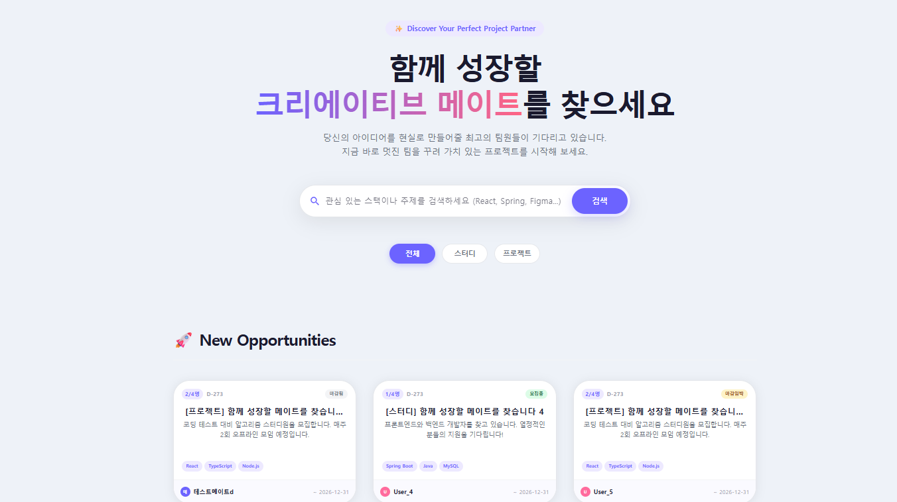

#### 모집글 상세
모집 현황, 진행 방식, 기술 스택을 확인하고 지원하는 화면입니다.
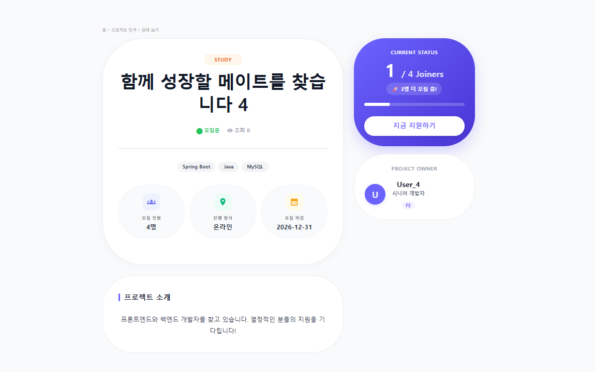

#### 모집글 수정
작성자가 등록한 모집글 정보를 수정하거나 삭제하는 화면입니다.
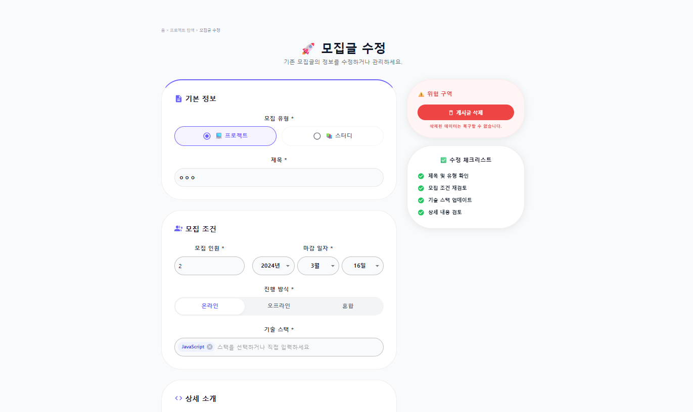

#### 팀 전용 게시판
모집이 확정된 팀원들이 소식을 공유하는 프로젝트 전용 게시판입니다.
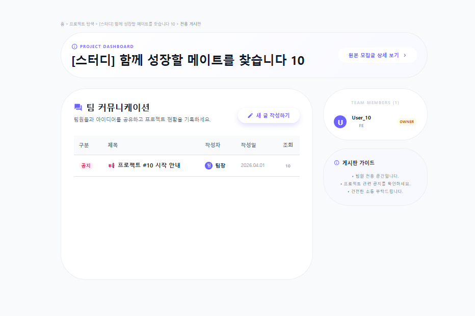

#### 게시판 글쓰기
팀 게시판에 공지·일반·질문 카테고리로 새 글을 작성하는 모달입니다.
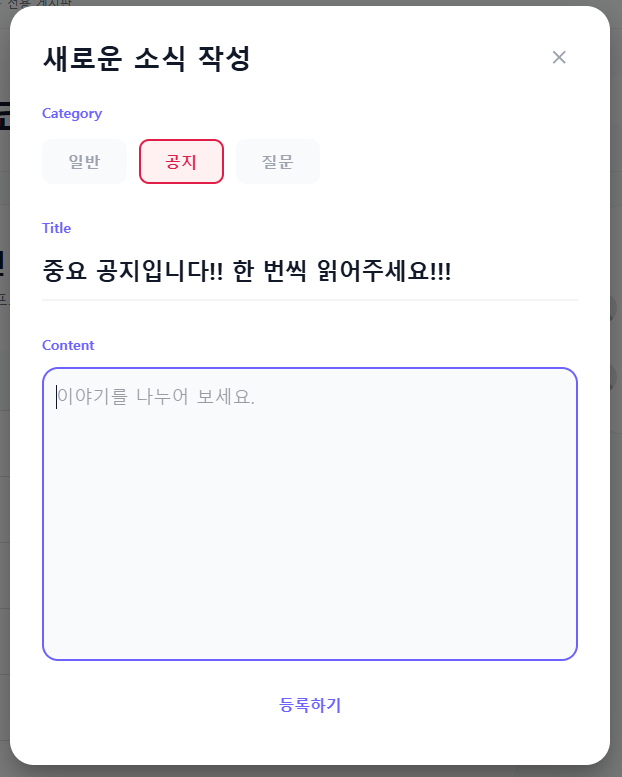

#### 게시글 상세 및 댓글
게시글 내용을 확인하고 댓글로 소통하는 모달입니다.
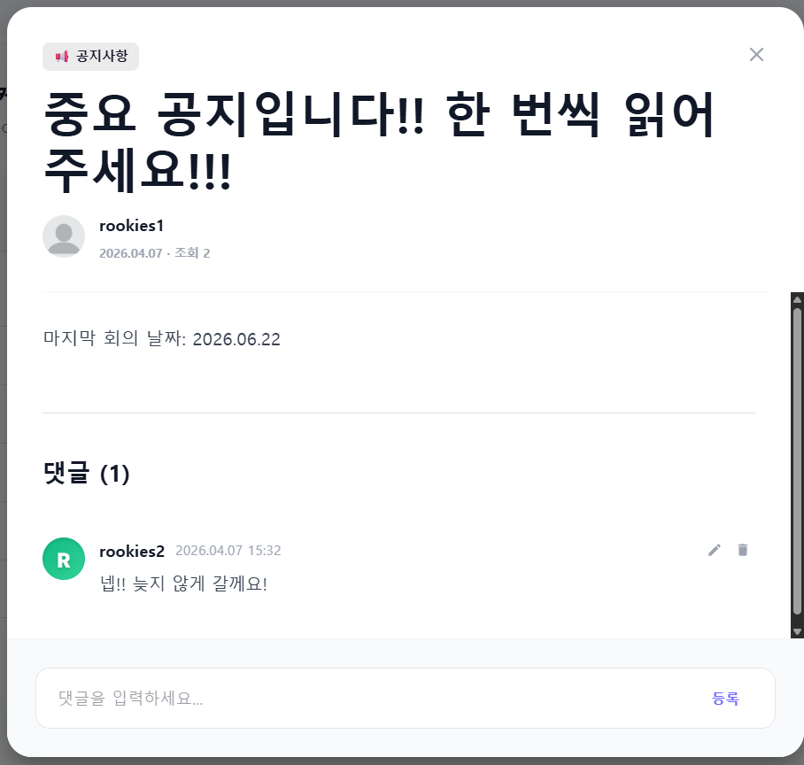

#### 로그인
이메일과 비밀번호로 로그인하는 화면입니다.
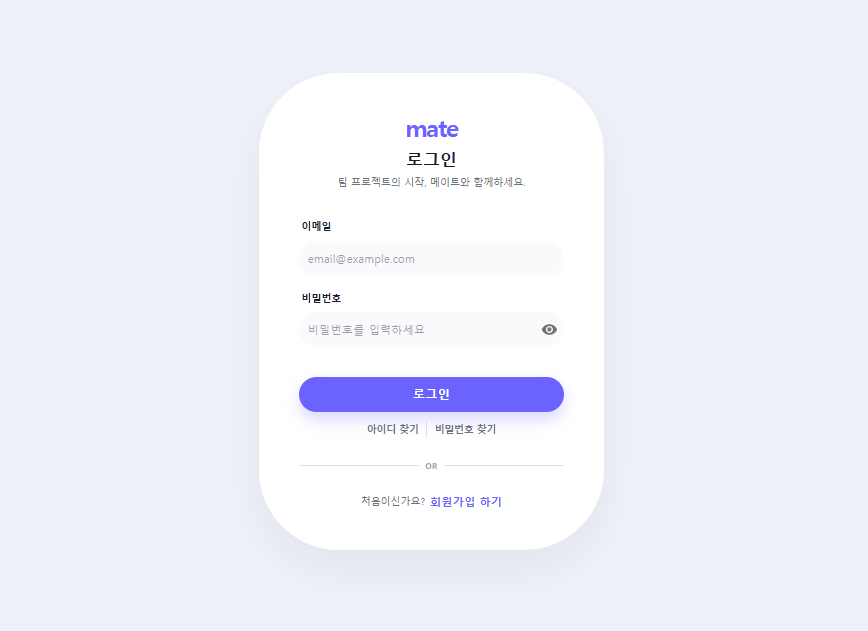

#### 회원가입
이메일, 비밀번호, 포지션, 기술 스택 등을 입력해 계정을 생성하는 화면입니다.
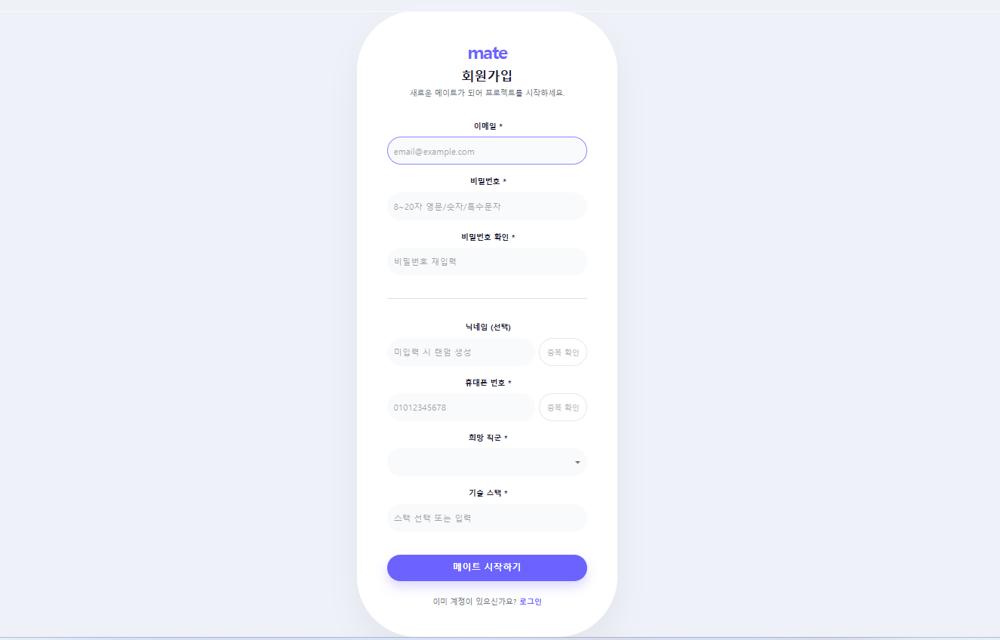

#### 모집글 작성
모집 유형, 인원, 마감일, 기술 스택 등을 입력해 모집글을 등록하는 화면입니다.
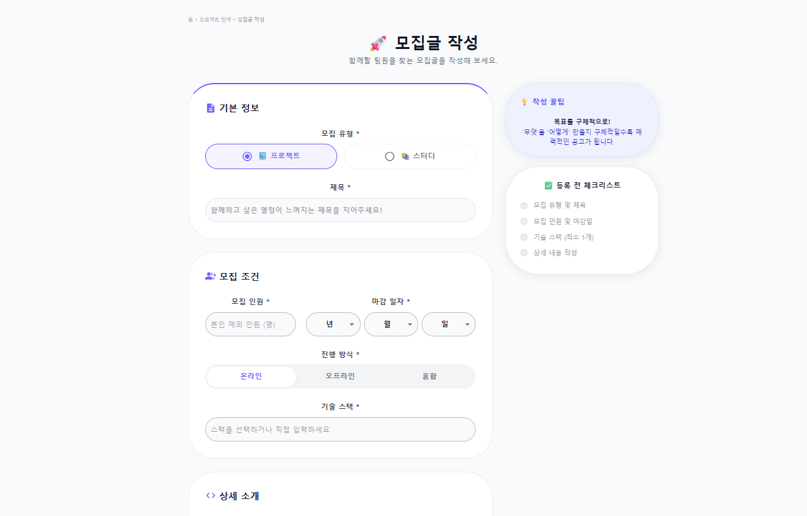

#### 마이페이지
프로필 정보 수정과 내 모집글·신청 현황·내 팀 활동을 관리하는 화면입니다.
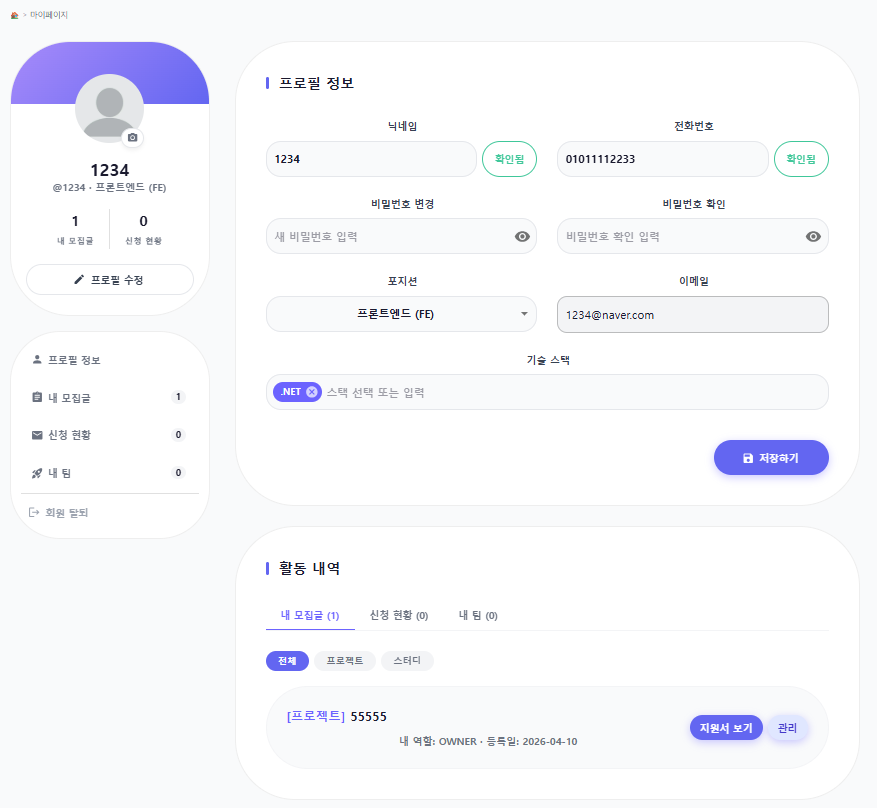

#### 아이디(이메일) 찾기
가입 시 등록한 휴대폰 번호로 이메일을 찾는 화면입니다.
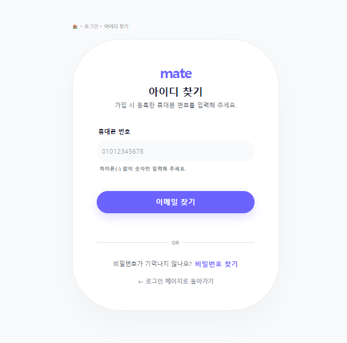

#### 비밀번호 찾기
이메일과 휴대폰 번호로 임시 비밀번호를 발급받는 화면입니다.
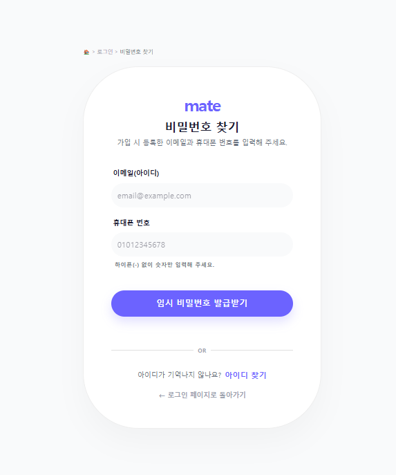

#### 지원서 작성
지원 분야, 자기소개, 참고 링크, 소통 채널을 입력해 모집글에 지원하는 화면입니다.
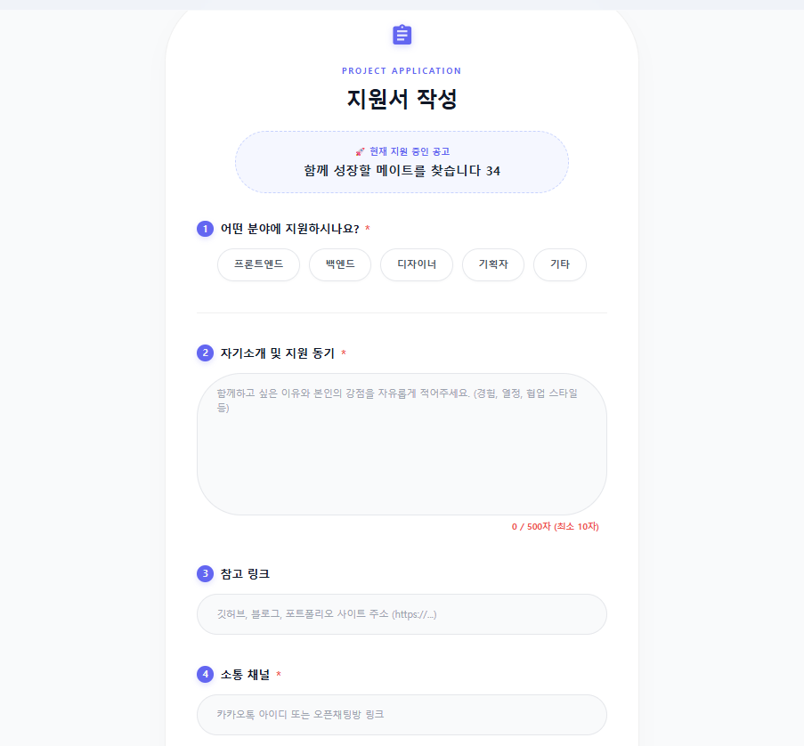

</details>

<br />

## <h3 id="technical">4. 🧩 기술 스택</h3>

### Frontend

<div>
  
  
  
  
</div>

- **React 19**: 컴포넌트 기반 UI 구현
- **Vite**: 빠른 개발 서버와 번들링 환경 구성
- **React Router DOM v7**: 페이지 라우팅 및 인증 라우트 분리
- **Zustand**: 인증, 모집글, UI 상태 관리

### UI & Styling

<div>
  
  
</div>

- **MUI(Material UI)**: 레이아웃, 폼, 카드, 모달, 탭 등 UI 컴포넌트 구성
- **Emotion**: MUI 기반 스타일 확장
- **MUI Icons**: 주요 액션과 상태를 아이콘으로 표현

### API & Development

<div>
  
  
  
</div>

- **Axios**: API 요청 공통 인스턴스와 인증 Interceptor 구성
- **MSW**: 백엔드 연동 전 독립적인 mock API 개발 환경 제공
- **ESLint**: 코드 품질 관리

<br />

## <h3 id="structure">5. 📦 프로젝트 구조</h3>

```plaintext
miniproject2-front
├─ public
│  └─ mockServiceWorker.js
├─ src
│  ├─ api
│  │  ├─ authApi.js
│  │  ├─ axiosInstance.js
│  │  ├─ boardApi.js
│  │  └─ postApi.js
│  ├─ assets
│  │  ├─ hero.png
│  │  ├─ react.svg
│  │  └─ vite.svg
│  ├─ component
│  │  ├─ common
│  │  │  ├─ Avatar.jsx
│  │  │  ├─ Badge.jsx
│  │  │  ├─ Breadcrumb.jsx
│  │  │  ├─ Button.jsx
│  │  │  ├─ ConfirmModal.jsx
│  │  │  ├─ FormInput.jsx
│  │  │  ├─ GuestRoute.jsx
│  │  │  ├─ Pagination.jsx
│  │  │  ├─ PostCard.jsx
│  │  │  ├─ ProtectedRoute.jsx
│  │  │  ├─ SkeletonCard.jsx
│  │  │  ├─ Tag.jsx
│  │  │  └─ ToastMessage.jsx
│  │  └─ layout
│  │     ├─ Footer.jsx
│  │     ├─ Header.jsx
│  │     └─ MainLayout.jsx
│  ├─ constants
│  │  └─ techStacks.js
│  ├─ mocks
│  │  ├─ browser.js
│  │  ├─ handlers.js
│  │  ├─ mockApplies.js
│  │  ├─ mockBoard.js
│  │  ├─ mockPosts.js
│  │  └─ mockUsers.js
│  ├─ pages
│  │  ├─ BoardPage.jsx
│  │  ├─ ErrorPage.jsx
│  │  ├─ FindEmailPage.jsx
│  │  ├─ FindPasswordPage.jsx
│  │  ├─ LoginPage.jsx
│  │  ├─ MainPage.jsx
│  │  ├─ MyAppliesPage.jsx
│  │  ├─ MyPage.jsx
│  │  ├─ MyPostsPage.jsx
│  │  ├─ PostApplyPage.jsx
│  │  ├─ PostDetailPage.jsx
│  │  ├─ PostEditPage.jsx
│  │  ├─ PostWritePage.jsx
│  │  └─ RegisterPage.jsx
│  ├─ store
│  │  ├─ authStore.js
│  │  ├─ postStore.js
│  │  └─ uiStore.js
│  ├─ styles
│  │  └─ theme.js
│  ├─ utils
│  │  └─ statusUtils.js
│  ├─ App.jsx
│  ├─ main.jsx
│  ├─ App.css
│  └─ index.css
├─ .env.development
├─ .env.production
├─ package.json
└─ vite.config.js
```

<br />

## <h3 id="api">6. 🔗 API 연동 및 환경 변수</h3>

### API 호출 구조

- `src/api/axiosInstance.js`에서 공통 Axios 인스턴스를 관리합니다.
- `VITE_API_BASE_URL` 값을 기준으로 API 서버 주소를 설정합니다.
- API 주소가 `/api`로 끝나지 않으면 자동으로 `/api`를 붙여 중복/누락을 방지합니다.
- Request Interceptor에서 로그인 사용자의 Access Token을 `Authorization: Bearer` 헤더에 자동 주입합니다.
- Response Interceptor에서 공통 응답 포맷 `{ success, data, message, timestamp }`를 처리합니다.
- `AUTH_002` 응답 시 Refresh Token으로 Access Token 재발급을 시도합니다.
- `AUTH_003` 응답 시 강제 로그아웃 후 로그인 페이지로 이동합니다.

### 환경 변수

```env
VITE_API_BASE_URL=/api
VITE_APP_ENV=development
```

프로덕션 환경에서는 배포 서버 주소에 맞춰 `VITE_API_BASE_URL`을 변경합니다.

<br />

## <h3 id="getting-started">7. ⚙️ 설치 및 실행</h3>

### 1. 저장소 클론

```bash
git clone https://github.com/hongjiho5148/miniproject2-front.git
cd miniproject2-front
```

### 2. 의존성 설치

```bash
npm install
```

### 3. 로컬 개발 서버 실행

```bash
npm run dev
```

실행 후 브라우저에서 `http://localhost:5173`으로 접속합니다.

### 4. 빌드

```bash
npm run build
```

### 5. 린트

```bash
npm run lint
```

<br />

## 🗂 관련 저장소

- Frontend: [https://github.com/hongjiho5148/miniproject2-front](https://github.com/hongjiho5148/miniproject2-front)
- Backend: [https://github.com/hongjiho5148/miniproject2-backend](https://github.com/hongjiho5148/miniproject2-backend)
